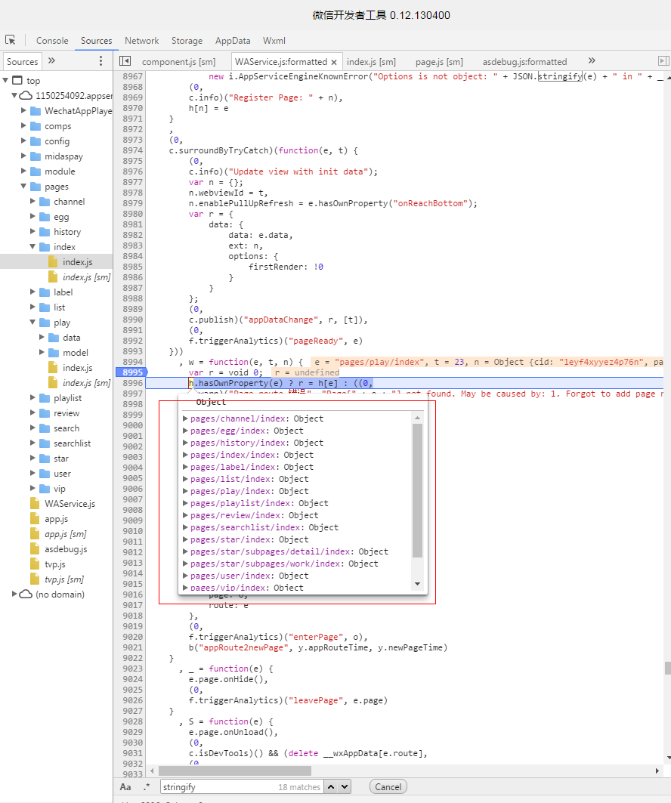
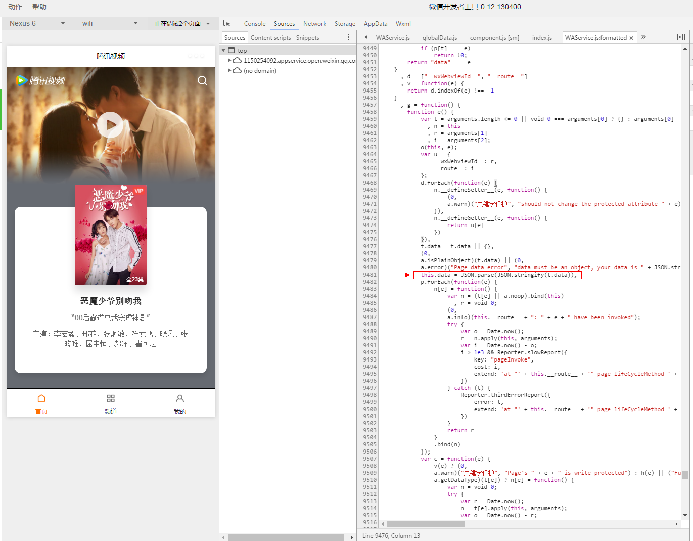

##几个微信小程序的优化技巧

作者：vicyao

转载请注明出处: [https://github.com/ysbcc/miniapp](https://github.com/ysbcc/miniapp)

小程序科普类的文章已经很多了，这里讲下针对小程序的优化方法，可以有效提高小程序的响应速度和用户体验。当然，开发体验也提高不少。


###1、提高页面加载速度——前端永恒不变的话题
在小程序这个环境下，怎样提高页面加载速度呢？
这个问题很大，我把问题具体一下，**如何缩短从用户点击某个链接，到打开新页面的这段时间？**
这里抛一个核心关键点：
>**从页面响应用户点击行为，开始跳转，到新页面onload事件触发，存在一个延迟，这个延迟大概在100-300ms之间（安卓响应比ios慢些）。**

这个延迟说短不短，我们可以利用这段时间，预先发起新页面所需要的网络请求。这样一来，就节省了100-300ms（或者一个网络请求的时间）。

知道有这个gap后，代码如何实现呢？

说白了，就是实现一个在A页面预加载B页面数据的功能。但而这种跨页面的调用，很容易把逻辑搞复杂，将不同页面的逻辑耦合在一起。所以，我们希望**将预加载的逻辑隐藏于无形中**，不增加任何的页面间耦合，以及开发复杂度。

下面以腾讯视频小程序为例，讲解下技术实现。

小程序首页：


当用户点击海报图后，会执行以下代码（就一行）：
```javascript
onPlay: function (e) {
		this.$route('/pages/play/index?cid='+this._cid);
}
```

接下来程序会加载播放页：


播放页主要代码：
```javascript
	fetchData: function (query) {
	},
	onNavigate: function (res) {
		this.$put('play-detail', this.fetchData(res.query));
	},
	onLoad: function (query) {
		this.$take('play-detail') || this.fetchData(query);
	}
```

可以看到，不管是外部页面的调用还是实际逻辑的实现都非常简洁。在第二个页面中，我们扩展了Page的生命周期函数，增加了**onNavigate**方法。该方法在页面即将被创建但还没开始创建的时候执行。

> 老司机也许会发现这里有点蹊跷。在首页点击的时候，播放页根本就没有创建，对象都不存在，怎么访问到里面的方法呢？

这里就要说下微信的页面机制。

在小程序启动时，会把所有调用Page()方法的object存在一个队列里（如下图）。每次页面访问的时候，微信会重新创建一个新的对象实例（实际上就是深拷贝）。也就是说，在A页面在执行点击响应事件的时候，B页面的实例还没创建，这时候调用的onNavigate方法，实际上是Page对象的原型（小程序启动时候创建的那个）。而接下来马上要被创建的B页面，又是另外一个object。所以，在onNavigate和onLoad方法中，this指针指的不是同一个对象，不能把临时数据存储在当前object身上。因此我们封装了一对全局的缓存方法，**$put()**和**$take()**。



为了通用性，Page上用到的公共的方法，比如$route、$put、$take都定义在了一个Page的基类里面。基类还同时保存了所有页面的list，这样就可以做到根据页面名调用具体页面的onNavigate方法。
当然，并不是每个页面都需要实现onNavigate方法，对于没有定义onNavigate方法的，$route函数会跳过预加载环节，直接跳转页面。所以对于开发者来说，不需要关心别的页面实现了什么，对外看来完全透明。


###2、用户行为预测
在上面的例子中，我们实现了用户主动点击页面，提前加载下一页面数据的方法。而在某些场景下，用户的**行为可以预测**，我们可以在用户还没点击的时候就预加载下个页面的数据。让下个页面秒开，进一步提升体验的流畅性。

继续以腾讯视频小程序为例，主界面分为3个页卡（大部分小程序都会这么设计），通过简单的数据分析，发现进入首页的用户有50%会访问第二个页卡。所以预加载第二个页卡的数据可以很大程度提高用户下个点击页面的打开速度。

同样，先看看代码实现。
首页预加载频道页的姿势：
```javascript
onReady: function(){
		//预加载频道页
		this.$preLoad("/pages/channel/index")
	}
```

频道页的实现方法：
```javascript
onPreload: function(req){
		//拉取数据
        this.fetchData({
            id: req.query.channelId ? req.query.channelId : defaultId,
            isPreload: true
        })
    }
```

跟第一个例子类似，这里定义了一个**$preLoad()**方法，同时给Page扩展了一个**onPreload**事件。页面调用$preLoad()后，基类会自动找到该页面对应的onPreload函数，通知页面执行预加载操作。
跟第一个例子不同，这里预加载的数据会保存在storage内，因为用户不一定会马上访问页面，而把数据存在全局变量会增加小程序占用的内存。微信会毫不犹豫的把内存占用过大的小程序给杀掉。

也许对于大部分有app开发经验的同学来说，更普遍的做法是先让页面展示上次缓存的数据，再实时拉取新数据，然后刷新页面。这个方法在小程序上也许体验并不太好，原因是小程序的性能以及页面渲染速度都不如原生app。将一个大的data传输给UI层，是一个很重的操作。因此不建议采用这种方法。


###3、减少默认data的大小
刚刚说到，页面打开一个新页面时微信会深拷贝一个page对象，因此，应该尽量减少默认data的大小，以及减少对象内的自定义属性。有图有真相：



以一个100个属性的data对象为测试用例，在iphone6上，页面的创建时间会因此增加150ms。

###4、组件化方案
微信没有提供小程序的组件化方案（相信一定在实现中）。但开谈不说组件化，写再多代码也枉然。这里演示一个简单的组件化实现。


以腾讯视频播放页为例，页面定义如下：
```javascript
P('play', {
	comps: [
		require('../../comps/player/index'),
		require("../../comps/toast/index")(),
		require("../../comps/topbar/topbar")(),
		require('../../comps/comment/index')(),
		require('../../comps/recommend/index')(),
		require('../../comps/playdesc/index')()
	],
	onLoad: function (query) {
	}
	...
}
```

其中，P()函数是自定义的**基类**。这是一个非常有用的东西，可以把所有通用的逻辑都写在基类里面，包括pv统计，来源统计，扩展生命周期函数，实现组件化等。

函数第一个参数是页面名称，作为页面的key。第二个是page对象，其中扩展了一个comps数组，里面就是所有要加载的组件。

以播放器组件/comps/player/index.js为例：
```javascript
module.exports = {
	data: {
		tvp: {
			url: '',
			state: "stop"
		}
	},
	onLoad: function (query) {
	},
	tvpStartPlay: function () {
	}
}
```
组件的定义跟一个普通Page对象一模一样，有data属性，onLoad、onShow等事件，也有页面响应的回调方法。wxml模板里定义的事件和js事件一一对应。

基类做的事情，就是把这些组件对象的属性和方法复制到Page对象上（浅拷贝）。其中data属性会merge到一起。而微信预定义的生命周期函数（包括自己扩展的），则封装成队列按序执行。比如当系统调用onLoad方法时，实际上是执行了所有组件的onLoad方法，最后再执行Page的onLoad。

以上是代码部分，至于wxml模板和wxss部分，就要手工import过去了。

wxml：
```html
<import src="/comps/comment/index.wxml" />
<import src="/comps/recommend/index.wxml" />
<import src="/comps/player/index.wxml"/>
<import src="/comps/toast/index.wxml"/>
<import src="/comps/playdesc/index.wxml"/>
<import src="/comps/topbar/index.wxml" />
```

wxss：
```css
@import "/style/tabbar.wxss";
@import "/comps/player/index.wxss";
@import "/comps/toast/index.wxss";
@import "/comps/comment/index.wxss";
@import "/style/empty.wxss";
@import "/comps/playdesc/index.wxss";
```


###5、其他
虽然小程序已经足够小巧，但启动速度还是有那么2-3秒，无法做到秒开。楼主尝试对小程序的启动时间做优化，但没有找到多少有价值的优化点。单个页面的初始化只需要1-2ms。也许大部分时间消耗在了微信跟服务器端通信的过程中。期待微信不断迭代优化。
